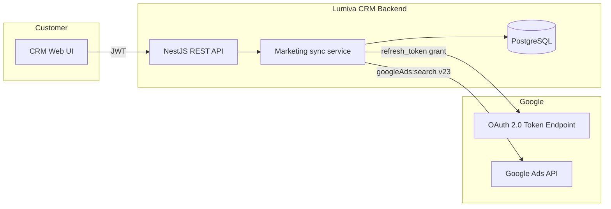

# Technical documentation — Google Ads API integration (Lumiva CRM)

**Русский (кратко):** это описание внутреннего модуля маркетинга Lumiva CRM: **только чтение** статистики кампаний через официальный Google Ads API для экранов отчётности клиента. Запись в аккаунты Google Ads не выполняется. Ниже полный текст **на английском** для пункта заявки в API Center.

---

## 1. Product overview

| Field | Description |
|--------|-------------|
| **Product name** | Lumiva CRM — Marketing & traffic module |
| **Type** | B2B SaaS CRM with embedded marketing analytics |
| **Primary use of Google Ads API** | **Read-only** synchronization of campaign performance metrics into the tenant’s private database for in-app dashboards (channels / traffic views). |
| **Website** | https://lumiva.agency (CRM instances are hosted per customer, e.g. customer-specific subdomains) |

The integration does **not** create, update, or delete Google Ads entities (campaigns, ads, budgets, etc.). It only **queries** reporting data.

---

## 2. Intended use and compliance

- **Use case:** Aggregate impressions, clicks, and cost by campaign and date so sales and marketing teams can compare paid search with other channels inside the CRM.
- **Access model:** Each customer (tenant) connects **their own** Google Ads customer account using OAuth 2.0 and stores credentials in their isolated tenant configuration.
- **Policy:** The tool is used for legitimate first-party reporting on accounts the customer owns or is authorized to manage. No scraping of third-party accounts; no resale of Google Ads API data as a standalone API product.

---

## 3. High-level architecture



- **Frontend:** Authenticated users trigger sync or rely on scheduled jobs.
- **Backend:** Node.js (NestJS), TypeORM, PostgreSQL.
- **Outbound calls:** `https://oauth2.googleapis.com/token` (token refresh) and `https://googleads.googleapis.com/v23/...` (reporting).

---

## 4. Google Ads API technical details

| Item | Value |
|------|--------|
| **API version** | **v23** (REST) |
| **Method** | `POST /v23/customers/{customerId}/googleAds:search` |
| **Authentication** | OAuth 2.0 **access token** (Bearer) + **developer token** header + optional **login-customer-id** for MCC hierarchies |
| **OAuth scope** | `https://www.googleapis.com/auth/adwords` (obtained during user consent; refresh token stored per integration) |

### 4.1 Example GAQL query (reporting only)

The application executes a **read-only** Google Ads Query Language (GAQL) query similar to:

```sql
SELECT
  campaign.name,
  segments.date,
  metrics.impressions,
  metrics.clicks,
  metrics.cost_micros
FROM campaign
WHERE segments.date BETWEEN '<start>' AND '<end>'
  AND campaign.status != 'REMOVED'
```

- Date range: **rolling last 30 days** (UTC), computed server-side at sync time.
- Pagination: `pageSize` up to 10,000 rows per request; follows `nextPageToken` until complete.

### 4.2 HTTP headers (conceptual)

- `Authorization: Bearer <access_token>`
- `developer-token: <developer_token>` (from integration settings or secure server environment)
- `Content-Type: application/json`
- `login-customer-id: <manager_id>` — **only if** the integration is configured for an MCC / manager context

---

## 5. OAuth 2.0 flow

1. The customer obtains a **refresh token** using a Google OAuth client (Google Cloud Console) with the Ads scope, following Google’s documented OAuth flow (e.g. consent screen, offline access).
2. The CRM stores **per-tenant** integration settings (encrypted at rest as part of standard database security practices), including:
   - `refresh_token`
   - `customer_id` (Google Ads customer ID)
   - `developer_token` (or server-level configuration)
   - optional `login_customer_id` for MCC
   - optional `client_id` / `client_secret` if the refresh token was issued by a dedicated OAuth client (must match the token issuer)
3. Before each sync, the backend calls `grant_type=refresh_token` on Google’s token endpoint to obtain a short-lived **access token**.

---

## 6. Application endpoints (internal)

All routes are prefixed with `/v1` and require **JWT authentication** for UI-driven operations (staff users). Tenant isolation is enforced on every query.

| Method | Route | Purpose |
|--------|--------|---------|
| `GET` | `/v1/marketing/integrations` | List marketing integrations |
| `POST` | `/v1/marketing/integrations` | Create integration |
| `PATCH` | `/v1/marketing/integrations/:id` | Update integration |
| `DELETE` | `/v1/marketing/integrations/:id` | Remove integration |
| `POST` | `/v1/marketing/integrations/:id/sync` | Run Google Ads sync for one integration |
| `POST` | `/v1/marketing/sync/google-ads` | Sync all active Google Ads integrations for the tenant |

*(Exact public hostname depends on customer deployment.)*

---

## 7. Data handling and storage

| Topic | Practice |
|--------|----------|
| **What is stored** | Aggregated rows: date, campaign name, impressions, clicks, cost (derived from `cost_micros`), currency, channel labels for CRM reporting (`dataSource = google_ads`). |
| **Where** | PostgreSQL, **tenant-scoped** tables (`marketing_traffic`, `marketing_integrations`). |
| **Retention** | Governed by the customer’s CRM data policy; no separate public feed of Google data. |
| **Resale** | Google Ads metrics are **not** exposed as a public API product; they appear only inside the authenticated CRM UI for that tenant. |

---

## 8. Scheduling and load

- **Manual:** User-initiated sync via the integrations screen.
- **Scheduled:** Optional daily cron (off-peak UTC) to refresh metrics for all active `google_ads` integrations across tenants.
- **Design:** Read-only, batch pulls with pagination; no tight loops or abusive polling patterns.

---

## 9. Security summary

- OAuth **client secrets** and **refresh tokens** are treated as secrets; transport over HTTPS only.
- API access from browsers uses **JWT** session security; Google Ads sync runs **server-side** only.
- **Developer token** can be configured globally (environment) or per integration where required.

---

## 10. Contact

For API Center verification questions, use the **technical / support contact** submitted in the Google Ads API access application (company email, domain matching the product).

---

*Document version: 1.0 — March 2026 — describes the Lumiva CRM marketing module Google Ads integration as implemented in the product codebase (Google Ads REST **v23**, `googleAds:search`, read-only reporting).*
